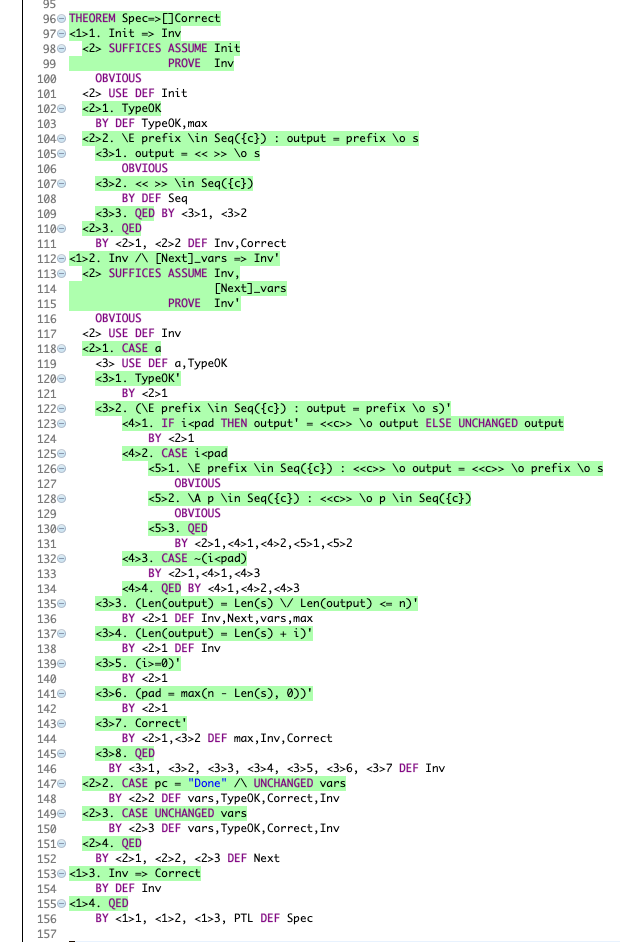
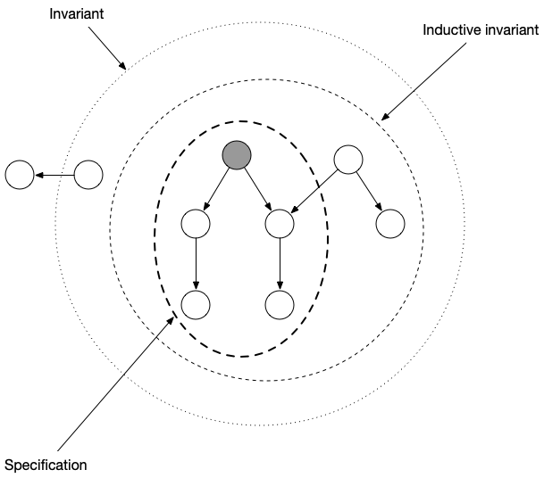

# [TLAPS]

## About TLAPS

THe TLA+ Proof System ([TLAPS]) is a mechanical proof checker for checking
a [structured proof] written in TLA+.

[TLAPS]: https://tla.msr-inria.inria.fr/tlaps/content/Home.html

## Leftpad in PlusCal

Here's the leftpad algorithm in [PlusCal] syntax.

```
--algorithm LeftPad
variables
    \* inputs
    c \in alphabet,
    n \in Nat,
    s \in Seq(alphabet),
    
    output = s,
    
    \* local vars
    pad = max(n - Len(s), 0),
    i = 0
begin    
a:  while i<pad do
        output := <<c>> \o output;
        i := i + 1;
    end while
end algorithm
```

I simply translated the implementation from the Dafny one into PlusCal. Too
late did I discover that there's a PlusCal implementation of leftpad in
[Practical TLA+].

[PlusCal]: https://lamport.azurewebsites.net/tla/pluscal.html
[Practical TLA+]: https://www.apress.com/us/book/9781484238288

## Proof by inductive invariance

### Proof by induction: a refresher

We prove the correctness of leftpad by induction. Recall (from your days in high school or
college math) that to prove a predicate P is true by induction:

1. Prove that P is true in the base case (N=1).
1. Prove that, if P is true for case N, it's true for case N+1.

To prove that a TLA+ state predicate, *Inv*, is true by induction, prove that: 

1. *Inv* is true for the initial state, *Init*
2. If *Inv* is true for an arbitrary state *s*, and *t* is any state such that the action formula *Next* is true for step *s→t*,
   then *Inv* is true for state *t*. 

In TLA+ syntax, those two statements are written as:

```
1. Init => Inv
2. Inv /\ Next => Inv'
```

### Using induction to prove correctness

To use induction to prove correctness, we ned to strategically choose a state
predicate called an *inductive invariant* (let's called it *Inv*) that has the following properties:

1. We can prove *Inv* by induction.
2. We can prove *Inv* implies the correctness property.

Written as a [structured proof], proof of correctness by inductive invariant looks like this:

```
THEOREM Spec=>[]Correct
<1>1. Init => Inv
<1>2. Inv /\ [Next]_vars => Inv'
<1>3. Inv => Correct
<1>4. QED
    BY <1>1, <1>2, <1>3
```

where `Inv` is the inductive invariant and `Correct` is the property you want
to prove. In this case, that property is the leftpad specification.

[structured proof]: https://www.microsoft.com/en-us/research/publication/write-21st-century-proof/


## The leftpad inductive invariant

Here's the inductive invariant used in this proof:

```
Inv == /\ TypeOK
       /\ \E prefix \in Seq({c}) : output = prefix \o s
       /\ Len(output) = Len(s) \/ Len(output) <= n
       /\ Len(output) = Len(s) + i 
       /\ pad = max(n - Len(s), 0)
       /\ i>=0
       /\ Correct
```

where `TypeOK` asserts the correct type of the variables, and `Correct` is the
correctness condition for leftpad.


## The leftpad proof 

If you're familiar with TLA+ syntax, you should be able to read the proof
without too much trouble.

The most interesting part of the proof is proving `<1>2. Inv /\ [Next]_vars => Inv'`. 
It's broken up into cases. At the top-level, we prove it for each possible
value of the `pc` variable, and for each of those, we prove `Inv'` for each of
the conjuncts of the inductive invariant.

Leftpad is simple enough that `pc` can only take on two values: `{"a",
"Done"}`, so our case analysis is pretty simple. Thet trickier one is the case
where `pc="a"`, that's done in `<2>1`.

TLAPS needed the most help for proving `<3>2. (\E prefix \in Seq({c}) : output = prefix \o s)'`,
so that one is broken up into the most steps. The case where `i<pad` is where
I needed to break it down into smaller steps:

```
<3>2. (\E prefix \in Seq({c}) : output = prefix \o s)'
  <4>2. CASE i<pad
    <5>1. \E prefix \in Seq({c}) : <<c>> \o output = <<c>> \o prefix \o s
        OBVIOUS
    <5>2. \A p \in Seq({c}) : <<c>> \o p \in Seq({c})
        OBVIOUS
    <5>3. QED
```

## Checking the proof with TLAPS

To verify that the proof is correct:

1. Install the [TLA+ toolbox]
1. Install the [TLA+ Proof system][TLAPS]
1. Open [LeftPad.tla](LeftPad.tla) in the toolbox.
1. Right click on the statement `THEOREM Spec=>[]Correct` and click "Prove Step or Module"

Many of the lines should turn green, including the line containing the `THEOREM`. TLAPS colors a statement
green if it was able to verify the proof of that statement. When the top-level
`THEOREM` statement is green, the entire theorem's proof has been checked.




[TLA+ toolbox]: https://lamport.azurewebsites.net/tla/toolbox.htm://lamport.azurewebsites.net/tla/toolbox.htmlkj 


## Invariants vs inductive invariants

The correctness property is an invariant. However, in general, correctness conditions are not *inductive
invariants*. That means that, while the correctness conditions are true in all possible states of the
specification, they can't be proved by induction.

To understand why, let's consider an algorithm that's a little
simpler than leftpad.

Here's an algorithm that just decrements a counter until it reaches 0, and then
stops, written in PlusCal notation:

```
--algorithm Decrement
variable i \in {1, 2};

begin
Outer:
    while i>0 do
    Inner:
        i := i-1;
    end while
end algorithm
```

It should be obvious that `i≥0` is an invariant of this specification. Let's
assume that this is our invariant `Inv`. Now, consider the following program state:

```
pc="Inner"
i=0
```

Here, `Inv` is true, but `Inv'` is false, because on the next step of the
behavior, *i* will be decremented to -1.



The above diagram is a Venn diagram of states. A bubble represents a state in TLA+. A bubble is
colored gray if it is an initial state in the specification (i.e. if the `Init`
predicate is true of that state). An arrow
represents a step, where the `Next` action is true for the pair of states
associated with the arrow.

The inner region shows all of the states that are in all allowed behaviors of
the specification.

The outer region represents an invariant: it contains all states where the
invariant holds. The middle region represents an inductive invariant: it
contains all states where an inductive invariant holds.

Note how there is an arrow from a state where the invariant holds to a state
where the invariant doesn't hold. That's because invariants are not inductive
in general.

In contrast, for states where the indutive invariant holds, all arrows that
start in those states terminate in states where the inductive invariant holds.

## Finding an inductive invariant

The hardest part of proof by inductive invariance is finding an invariant
that's inductive. If the invariant you come up with isn't inductive, you
wont't be able to write the proof. 

You can use TLC to help find an inductive invariant. My strategy was to start
with `Inv = TypeOK /\ Correct` and use TLC to check if `Inv` was, indeed, an
inductive invariant. When a counterexample was found, I added another
conjunction to tighten up my invariant.

To check if my invariant was inductive, I created the `ISpec` definition:

```
ISpec == Inv /\ [][Next]_vars
```

Then I ran the following TLC model:

```
Temporal formula: ISpec
What is the model?
    alphabet <- {"a", "b"}
Invariants: Correct
Definition Override:
    Nat <- 0..3
    Seq(S) <- UNION {[1..m -> S] : m \in Nat}
```

In my case, this model was small enough to run quickly and large enough to
find all of the problems with my proposed inductive invariants.

In general, checking an inductive invariant is hard because the state space can
be enormous. Lamport describes a strategy for using pseudo-random sampling of
a larger state space in [Using TLC to Check Inductive Invariance](https://lamport.azurewebsites.net/tla/inductive-invariant.pdf).
