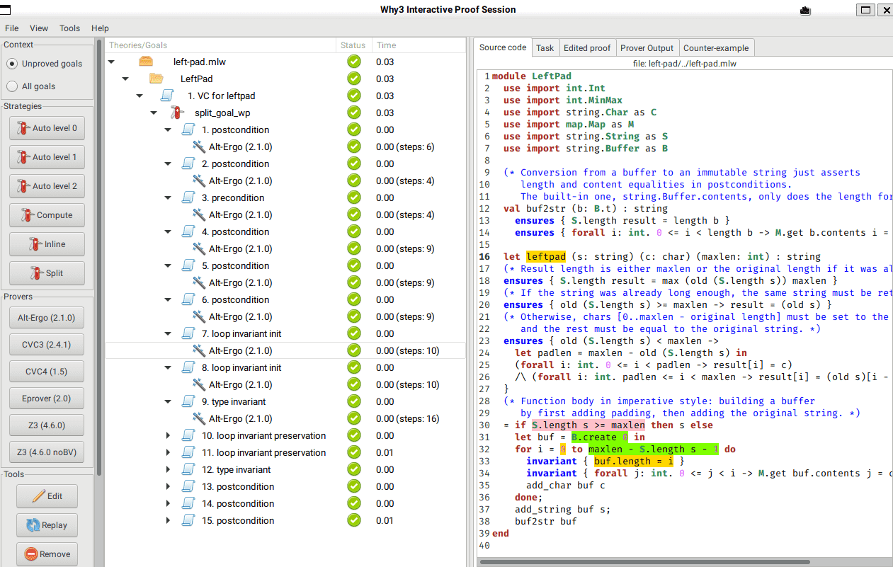

# [Why3](http://why3.lri.fr/)

## About Why3

Why3 is a deductive verification platform that provides a programming and specification language called WhyML, which supports many imperative and functional constructs.
WhyML is often used as an intermediate verification language (e.g. by Frama-C's WP plugin and SPARK), but you can also go in the opposite direction and extract correct-by-construction OCaml programs from WhyML code (though the extracted code uses model types instead of standard library types).

Why3 generates verification conditions that can be discharged using both automatic provers (many SMT solvers and saturation-based solvers) and proof assistants (Coq, PVS, Isabelle/HOL).
Why3 provides an IDE that shows a list of verification conditions and allows you to interactively apply transformations (e.g. splitting) on them, launch the provers and hopefully see green checkmarks :)

## About the Proof

Like with other specification-based tools, the same thing is expressed as both specification and implementation, and the tool is concerned with proving their equivalence.
No manual proof is necessary, everything is proved automatically.

The standard library provides characters, (immutable) strings and (mutable) buffers.
However, the provided conversion function from buffers to strings only asserts the equality of the length and not of the content, so a new one was written.

The `leftpad` function is implemented in an imperative way.
It creates a zero-sized buffer, appends the padding character to it as many times as necessary using a loop, and then appends the string.

Because WhyML has a `for .. to` construct, there's no need for a *loop variant*, termination is already obvious.
But *loop invariants* are used to make sure the function's postcondition is preserved on every iteration.

## How to Run the Proof

First, you need to install Why3 (e.g. using OCaml's [OPAM](https://opam.ocaml.org) package manager, or your OS's) and some provers (e.g. [Alt-Ergo](https://alt-ergo.ocamlpro.com/) is also available on OPAM).

Then, tell Why3 to find the provers:

```bash
$ why3 config --detect-provers
```

Now you can prove left-pad in command-line (batch) mode using the provers you have:

```bash
$ why3 prove -P alt-ergo left-pad.mlw
left-pad.mlw LeftPad WP_parameter leftpad : Valid (0.04s, 197 steps)

$ why3 prove -P z3 left-pad.mlw
left-pad.mlw LeftPad WP_parameter leftpad : Valid (0.02s)
```

Or launch the GUI to explore the proof (hint: select the goal and click Split to get the subgoals):

```bash
$ why3 ide left-pad.mlw
```



## About Me

Hi, I'm [Greg](https://unrelenting.technology), I make open source libraries and applications.
